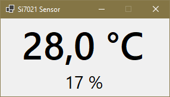

# Monitoring Application for Si7021 Sensor

This a .NET 6 application for reading Si7021 (HTU21D) sensor, which provides measurement of ambient temperature and relative humidity. For sensor connection a USB-to-SMBus adapter board (based on CP2112 chip) is required.

